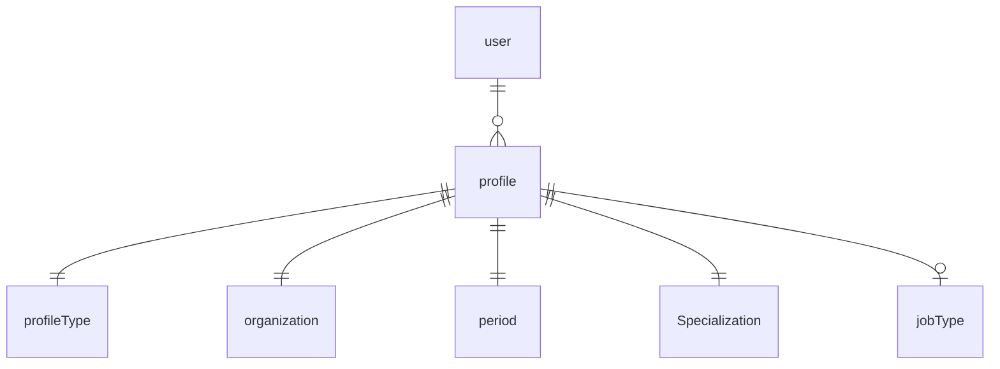
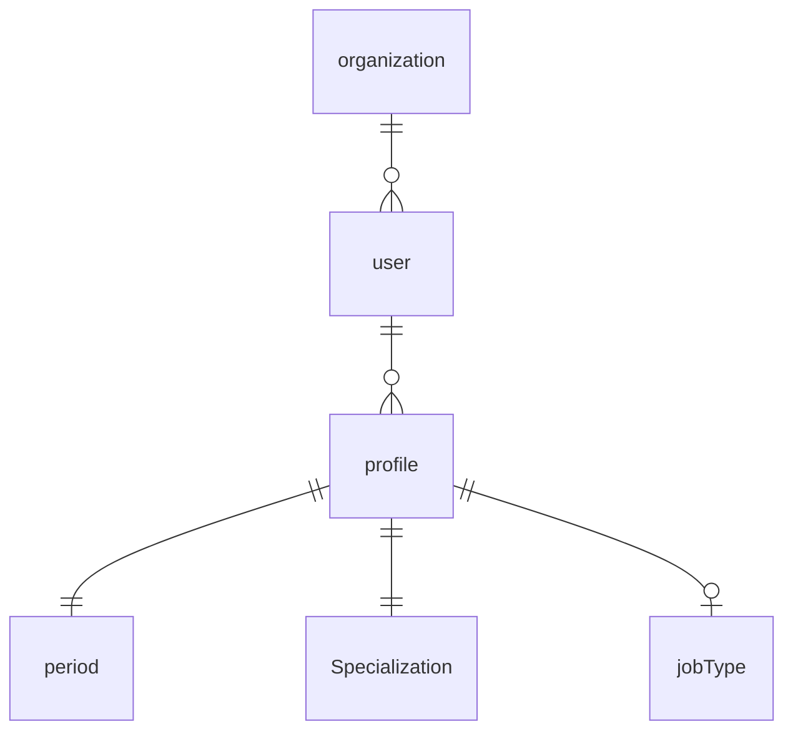
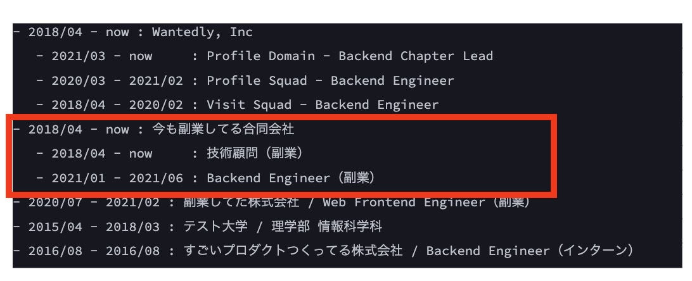

# about-me

## 概念モデル
### ユーザーから見たモデル

### 所属先の組織から見たモデル

## 工夫したポイント
- [ユーザ視点でのモデル](https://github.com/rei1011/about-me/blob/main/domain/profile/user_profile.go)と、[所属先の組織から見たモデル](https://github.com/rei1011/about-me/blob/main/domain/profile/organization_profile.go)を組み合わせて実装した
  - 当初はユーザ視点のモデルだけで実装していたが、グルーピングを実装する際に、以下の赤枠は所属先の組織から見た経歴とも捉えることができたので、モデルを分けて考えた

 
- 所属先ごとに履歴を分かりやすくするため、[組織単位でグルーピング](https://github.com/rei1011/about-me/blob/a8884def80b726de67c85668b7d6ac6c7e0124fd/domain/profile/organization_profile.go#L15)した後、[組織への所属終了日が遅い順で並び替えた](https://github.com/rei1011/about-me/blob/a8884def80b726de67c85668b7d6ac6c7e0124fd/domain/profile/organization_profile.go#L35)
  - 上記を実現するにあたって、[組織単位での所属期間を計算](https://github.com/rei1011/about-me/blob/a8884def80b726de67c85668b7d6ac6c7e0124fd/domain/profile/organization_profile.go#L84)できるようにした

- 同じ企業の職歴（異動etc）に関しても[終了日が遅い順でソート](https://github.com/rei1011/about-me/blob/a8884def80b726de67c85668b7d6ac6c7e0124fd/domain/profile/user_profile.go#L26)するようにした

- 職歴もしくは学歴のみを表示できるように、[職歴と学歴をグルーピング](https://github.com/rei1011/about-me/blob/a8884def80b726de67c85668b7d6ac6c7e0124fd/domain/profile/user_profile.go#L56)できるようにした

- [所属開始日が設定されていない](https://github.com/rei1011/about-me/blob/a8884def80b726de67c85668b7d6ac6c7e0124fd/domain/period/period.go#L15)、もしくは[所属開始日>所属終了日になる](https://github.com/rei1011/about-me/blob/a8884def80b726de67c85668b7d6ac6c7e0124fd/domain/period/period.go#L22)ことは現実的にありえないので、errorを投げるようにした

- 学歴に雇用形態は存在しないため、[学歴から雇用形態を取得した場合はerrorを返す](https://github.com/rei1011/about-me/blob/a8884def80b726de67c85668b7d6ac6c7e0124fd/domain/profile/user_profile.go#L91)ようにしたj